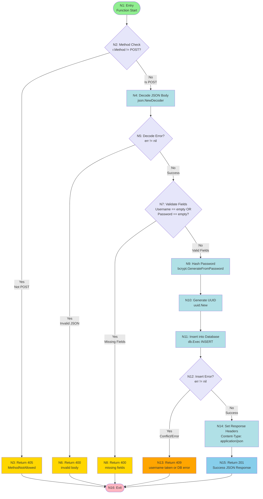

# Control Flow Graph for registerHandler Function

## Function: registerHandler

---

## Node Definitions

| Node | Type         | Description                                     |
| ---- | ------------ | ----------------------------------------------- |
| N1   | Entry        | Function entry point                            |
| N2   | Decision     | HTTP method validation check                    |
| N3   | Error Exit   | Return HTTP 405 Method Not Allowed              |
| N4   | Process      | Decode JSON request body                        |
| N5   | Decision     | Check if JSON decode succeeded                  |
| N6   | Error Exit   | Return HTTP 400 for invalid JSON                |
| N7   | Decision     | Validate username and password not empty        |
| N8   | Error Exit   | Return HTTP 400 for missing fields              |
| N9   | Process      | Generate bcrypt password hash                   |
| N10  | Process      | Generate UUID for new user                      |
| N11  | Process      | Execute database INSERT statement               |
| N12  | Decision     | Check if database insert succeeded              |
| N13  | Error Exit   | Return HTTP 409 for duplicate username/DB error |
| N14  | Process      | Set Content-Type response header                |
| N15  | Success Exit | Return HTTP 201 with user data                  |
| N16  | Exit         | Function termination point                      |

---

## Edges (Control Flow Transitions)

| Edge | From → To | Condition | Description                        |
| ---- | --------- | --------- | ---------------------------------- |
| 1    | N1 → N2   | Always    | Start function execution           |
| 2    | N2 → N3   | True      | Method is not POST                 |
| 3    | N2 → N4   | False     | Method is POST                     |
| 4    | N3 → N16  | Always    | Exit after 405 error               |
| 5    | N4 → N5   | Always    | JSON decode attempted              |
| 6    | N5 → N6   | True      | Decode failed (err != nil)         |
| 7    | N5 → N7   | False     | Decode succeeded (err == nil)      |
| 8    | N6 → N16  | Always    | Exit after 400 error               |
| 9    | N7 → N8   | True      | Username empty OR password empty   |
| 10   | N7 → N9   | False     | Both username and password present |
| 11   | N8 → N16  | Always    | Exit after validation failure      |
| 12   | N9 → N10  | Always    | Password hashed successfully       |
| 13   | N10 → N11 | Always    | UUID generated                     |
| 14   | N11 → N12 | Always    | Database insert attempted          |
| 15   | N12 → N13 | True      | Insert failed (err != nil)         |
| 16   | N12 → N14 | False     | Insert succeeded (err == nil)      |
| 17   | N13 → N16 | Always    | Exit after database error          |
| 18   | N14 → N15 | Always    | Headers set                        |
| 19   | N15 → N16 | Always    | Exit after successful response     |

---

## Prime Paths (basis paths from N1 to N16):

1. **P1**: N1 → N2 → N3 → N16 (Method not POST)
2. **P2**: N1 → N2 → N4 → N5 → N6 → N16 (Decode error)
3. **P3**: N1 → N2 → N4 → N5 → N7 → N8 → N16 (Validation fails)
4. **P4**: N1 → N2 → N4 → N5 → N7 → N9 → N10 → N11 → N12 → N13 → N16 (DB error)
5. **P5**: N1 → N2 → N4 → N5 → N7 → N9 → N10 → N11 → N12 → N14 → N15 → N16 (Success)

## Edge Pairs for Coverage:

### All Edge Pairs:
1. (N1→N2, N2→N3) - Wrong method
2. (N1→N2, N2→N4) - Correct method
3. (N2→N4, N4→N5) - Decode attempt
4. (N4→N5, N5→N6) - Decode fails
5. (N4→N5, N5→N7) - Decode succeeds
6. (N5→N7, N7→N8) - Validation fails
7. (N5→N7, N7→N9) - Validation succeeds
8. (N7→N9, N9→N10) - Hash generated
9. (N9→N10, N10→N11) - UUID generated
10. (N10→N11, N11→N12) - Insert attempted
11. (N11→N12, N12→N13) - Insert fails
12. (N11→N12, N12→N14) - Insert succeeds
13. (N12→N14, N14→N15) - Headers set
14. (N14→N15, N15→N16) - Success response

### Test Cases:

**Prime Path Coverage:**
1. **TC1**: Non-POST method → P1
2. **TC2**: Invalid JSON body → P2
3. **TC3**: Missing fields → P3
4. **TC4**: Database error → P4
5. **TC5**: Valid registration → P5

**Real-World Security & Edge Cases:**
6. SQL injection attempts
7. Unicode/international characters
8. Extremely long inputs (DoS)
9. Special characters in email/password
10. Duplicate username handling
11. Case sensitivity testing
12. Empty email field
13. Null bytes and control characters
14. Extra JSON fields ignored

## Coverage Summary:

- **Prime Path Coverage**: All 5 paths covered
- **Edge Pair Coverage**: All 14 pairs covered
- **Decision Coverage**: 100%
- **Condition Coverage**: 100%
- **Real-World Cases**: SQL injection, Unicode, DoS, special chars, duplicates, case handling
