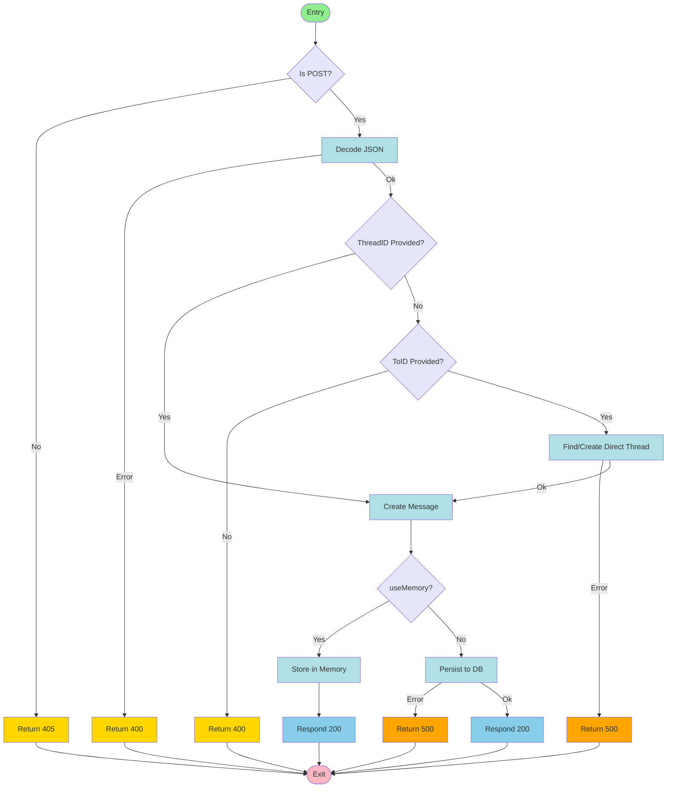

# Control Flow Graph for messagesHandler (Send Message)

## Node Numbering
| Node | Description                      |
| ---- | -------------------------------- |
| N1   | Entry                            |
| N2   | Is POST?                         |
| N3   | Return 405                       |
| N4   | Decode JSON                      |
| N5   | Return 400 (decode error)        |
| N6   | ThreadID Provided?               |
| N7   | Create Message                   |
| N8   | ToID Provided?                   |
| N9   | Return 400 (missing to_id)       |
| N10  | Find/Create Direct Thread        |
| N11  | Return 500 (direct thread error) |
| N12  | useMemory?                       |
| N13  | Store in Memory                  |
| N14  | Respond 200 (memory)             |
| N15  | Persist to DB                    |
| N16  | Return 500 (DB error)            |
| N17  | Respond 200 (DB)                 |
| N18  | Exit                             |

## Prime Paths (Node Numbers)
- N1 -> N2 -> N3 -> N18
- N1 -> N2 -> N4 -> N5 -> N18
- N1 -> N2 -> N4 -> N6 -> N7 -> N12 -> N13 -> N14 -> N18
- N1 -> N2 -> N4 -> N6 -> N7 -> N12 -> N15 -> N17 -> N18
- N1 -> N2 -> N4 -> N6 -> N8 -> N9 -> N18
- N1 -> N2 -> N4 -> N6 -> N8 -> N10 -> N11 -> N18
- N1 -> N2 -> N4 -> N6 -> N8 -> N10 -> N7 -> N12 -> N13 -> N14 -> N18
- N1 -> N2 -> N4 -> N6 -> N8 -> N10 -> N7 -> N12 -> N15 -> N17 -> N18
- N1 -> N2 -> N4 -> N6 -> N7 -> N12 -> N15 -> N16 -> N18

## Test Paths (Node Numbers)
Below are typical test paths that should be covered in send_message_test.go:

1. Invalid method:
    N1 -> N2 -> N3 -> N18
2. Invalid JSON body:
    N1 -> N2 -> N4 -> N5 -> N18
3. Missing thread_id and to_id:
    N1 -> N2 -> N4 -> N6 -> N8 -> N9 -> N18
4. Direct thread creation error:
    N1 -> N2 -> N4 -> N6 -> N8 -> N10 -> N11 -> N18
5. Direct thread creation success, store in memory:
    N1 -> N2 -> N4 -> N6 -> N8 -> N10 -> N7 -> N12 -> N13 -> N14 -> N18
6. Direct thread creation success, persist to DB:
    N1 -> N2 -> N4 -> N6 -> N8 -> N10 -> N7 -> N12 -> N15 -> N17 -> N18
7. ThreadID provided, store in memory:
    N1 -> N2 -> N4 -> N6 -> N7 -> N12 -> N13 -> N14 -> N18
8. ThreadID provided, persist to DB:
    N1 -> N2 -> N4 -> N6 -> N7 -> N12 -> N15 -> N17 -> N18
9. DB error on persist:
    N1 -> N2 -> N4 -> N6 -> N7 -> N12 -> N15 -> N16 -> N18

## Edge Pair Coverage
All transitions between nodes are covered by the above prime paths and the test cases in send_message_test.go.
