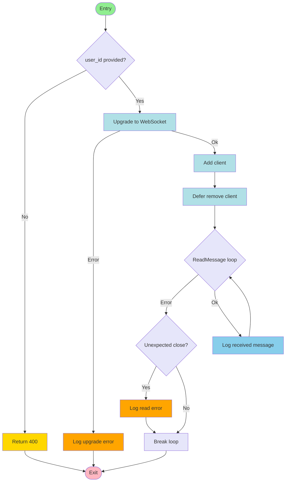

# Control Flow Graph for wsHandler (WebSocket Handler)

## Node Numbering
| Node | Description |
|------|-------------|
| W1   | Entry |
| W2   | user_id provided? |
| W3   | Return 400 |
| W4   | Upgrade to WebSocket |
| W5   | Log upgrade error |
| W6   | Add client |
| W7   | Defer remove client |
| W8   | ReadMessage loop |
| W9   | Unexpected close? |
| W10  | Log read error |
| W11  | Break loop |
| W12  | Log received message |
| W13  | Exit |

## Prime Paths (Node Numbers)
- W1 → W2 → W3 → W13
- W1 → W2 → W4 → W5 → W13
- W1 → W2 → W4 → W6 → W7 → W8 → W9 → W10 → W11 → W13
- W1 → W2 → W4 → W6 → W7 → W8 → W9 → W11 → W13
- W1 → W2 → W4 → W6 → W7 → W8 → W12 → W8 (loop)

## Test Paths (Node Numbers)
1. Missing user_id:
   W1 → W2 → W3 → W13
2. WebSocket upgrade error:
   W1 → W2 → W4 → W5 → W13
3. Successful connection, immediate close (unexpected):
   W1 → W2 → W4 → W6 → W7 → W8 → W9 → W10 → W11 → W13
4. Successful connection, normal close:
   W1 → W2 → W4 → W6 → W7 → W8 → W9 → W11 → W13
5. Successful connection, message received:
   W1 → W2 → W4 → W6 → W7 → W8 → W12 → W8 (loop)

## Edge Pair Coverage
All transitions between nodes are covered by the above prime paths and the test cases in ws_handler_test.go.
